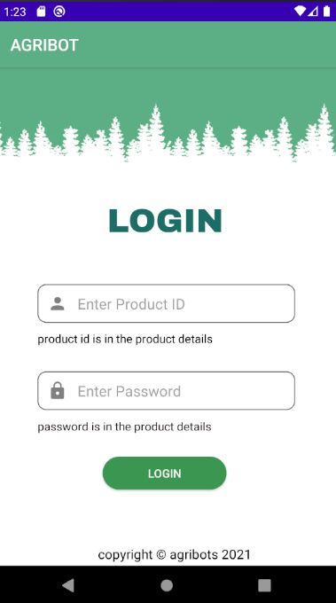

<!DOCTYPE html>
<html>
<head>
</head>
<body>
	<h2>Autonomous Agricultural Robot - Mobile Application</h2>
	<h4>Group Members</h4>
		

			
Denuke Dissanayake - E/16/089 - e16089@eng.pdn.ac.lk

			
Maneesha Randeniya - E/16/313 - e16313@eng.pdn.ac.lk

			
Nipun Dewanarayana - E/16/360 - e16360@eng.pdn.ac.lk

		

    <h4>Description</h4>
		

			
AgriBot is an automated robot. A mobile app is used to collect the information and displayed a graphical change oftemperature and humidity to the user. Mobile app is used to give start, stop, pause commands to the robot and details about the field, like row length, gap of seeds, gap of rows, how many rows like that.
using those informations robot will go to each point and drill the soil, plant a seed.
      
 
			
The main purpose of our Robot is plant seeds over large farm areas!!!!
 
      
In the system, robot will connected to the AWS server, inside that robot and app will connect through mqtt broker. Mainly this application sends messages which critical in the system like start, stop, pause signals. Also initial configuration and also connectivity of the device. In the robot side it will receive these and also output sensor data to the broker. Mobile application is display these data. For these tasks we use MQTT architecture and protocol which is the best solution for IOT. This is different from normal http architecture and for that we use java library - paho.mqtt lib for this implementation. Android application made from java (native approach) which is run faster. If you more interested about this App and project, project site attached to this markdown.
	     
project site https://cepdnaclk.github.io/e16-3yp-agribot/
project git  https://github.com/Nipun-Dewenarayane/e16-3yp-agribot	      
      

		

	 
	<h4>Mobile App Screen Shots</h4>
	 
	<table width="100%" border="0">
		<tr>
			<td></td>
			<td></td>
    			<td></td>
		</tr>
		<tr>
			<td></td>
			<td></td>
		</tr>
	</table>
	
   <h4>Advisers</h4>
    
 Dr Isuru Nawinna 

    
 Dr Ziyan Marrikkar 

		<h4>Links :</h4>
			

				
<a href="https://www.pdn.ac.lk/academics/academics.php/ "> University of Peradeniya</a> 

				
<a href="http://eng.pdn.ac.lk/"> Faculty of Engineering</a>

        
<a href="http://www.ce.pdn.ac.lk/"> Department of Computer Engineering </a> 

			

	
	
</body>
</html>
