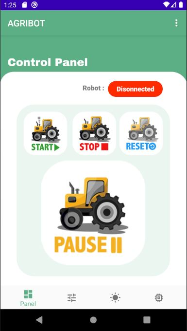
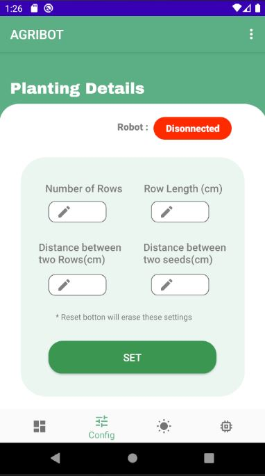
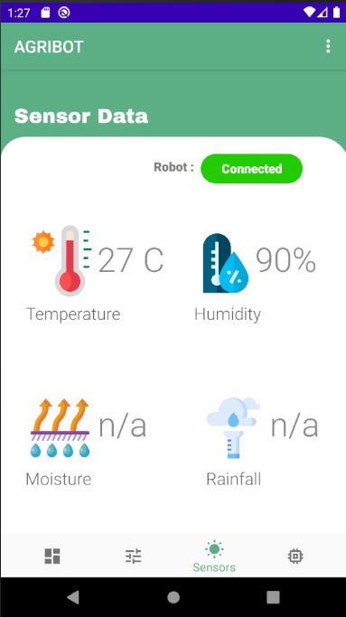

<!DOCTYPE html>
<html>
<head>
	<h2>Autonomous Agricultural Robot - Mobile Application</h2>
</head>
<body>
	<h4>Group Members</h4>
		

			
Denuke Dissanayake - E/16/089 - e16089@eng.pdn.ac.lk

			
Maneesha Randeniya - E/16/313 - e16313@eng.pdn.ac.lk

			
Nipun Dewanarayana - E/16/360 - e16360@eng.pdn.ac.lk

		

    <h4>Description</h4>
		

			
AgriBot is an automated robot. A mobile app is used to collect the information and displayed a graphical change oftemperature and humidity to the user. Mobile app is used to give start, stop, pause commands to the robot and details about the field, like row length, gap of seeds, gap of rows, how many rows like that.
using those informations robot will go to each point and drill the soil, plant a seed.
      
 
			
The main purpose of our Robot is plant seeds over large farm areas!!!!
 
      
As we said earlier Our mobile app give the basic control signals and parameters of the field to the AWS server and the robot will fetch it and create a map of the field using some algorithms, then using the encoders of the gear motors and gyroscope we can move the robot throughout the map and plant the seeds, After we send the basic params from our mobile app whole process works as a autonomous manner. User have to give the number of rows he want to seed, gap between two seeds and two rows and length of a each row. Using this method, we can cover the whole area.
      

		

	 
	<h4>Mobile App Screen Shots</h4>
	 
	

		<ul>
			<li></li>
			<li></li>
			<li></li>
			<li></li>
		</ul>
		
	

	
   <h4>Advisers</h4>
    
 Dr Isuru Nawinna 

    
 Dr Ziyan Marrikkar 

		<h4>Links :</h4>
			

				
<a href="https://www.pdn.ac.lk/academics/academics.php/ "> University of Peradeniya</a> 

				
<a href="http://eng.pdn.ac.lk/"> Faculty of Engineering</a>

        
<a href="http://www.ce.pdn.ac.lk/"> Department of Computer Engineering </a> 

			

	
	
</body>
</html>
